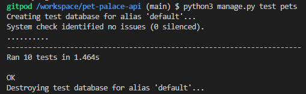
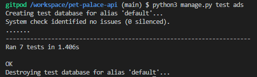

# Pet Palace API

## Models

At the start of the project, a database model was created to map out the scope and information needs for the database.
The post, comments, likes, following and profile entities are greatly inspired by the Code Institue django rest API walkthrough project, the rest is custom to this project.

A conceptual model was made at first to easily visualise what the database would look like and which entities were needed.


Once that was finished a more detailed logical database model was made with all attributes and data types.


The scope of the database is quite wide to take into consideration that the project might grow in the future, leaving room for future features that might not be implemented in the first release.

## Apps

The Pet Palace API has got # nr of apps, the different apps and their purpose is described as follows:

### Profile app

An app for the user's profile, the profile is created automatically when they sign up and create a user, the profile can only be edited, it is not possible to delete it, and the user can also only have one profile. There is also some functionality to count the number of followings and followers.

The profile model holds information about the user,
such as name, description of them, profile image, if they are a pet owner or not,
and when the profile was created and updated.

A default image will be displayed until the user changes it, this is from the Code Institute django rest walkthrough.

If the user is a pet owner, they will need to update their profile and check the checkbox for a pet owner, if not, they will be a regular user.
If the user checks the pet owner box, they will get a small icon next to their name, and users should be able to filter to display posts and ads from only pet owners if they'd like.

### Post app

The code for the Post app is greatly inspired by the Code Institute django rest framework walkthrough, with minor alterations to fit my project.

All logged-in users will be able to create, update and delete a post.
The post will contain an image, title, content, category, date of creation and date of updating.

The content field is allowed to be blank, but the user must add a title, if they don’t add an image a default will be displayed.
The user can also add a filter to the image.

There is some filter and search functionality as well as some functionality to count the number of comments and likes on each post, all from the Code Institute django rest walkthrough code.

### Comment app

The code for the comment app comes from the Code Institute django rest walkthrough with minor alterations and some added testing.
It allows users to comment on each other's posts and the user can view, update and delete comments.

The user must be logged in to be able to comment and can only edit and delete the comment that they made.

### Like app

The code for the like app comes from the Code Institute django rest walkthrough with minor alterations such as using UniqueConstraint instead of unique_toghether.

It allows users to like each other's posts as well as view and delete the likes, the user must be logged in to be able to like a post and can only delete the likes that they made, they can only like a post once.

### Follower app

The code for the follower app comes from the Code Institute django rest walkthrough with minor alterations such as using UniqueConstraint instead of unique_toghether.

It allows users to follow each other

### Pet app


The pet model will contain information about the pet, such as name, what type of pet it is, how old it is, an image of the pet and a description where the owner can describe their pet and write some information that could be good for the potential pet sitter. The pet will be linked to the owner with a Foreign Key.

I considered adding a field for the breed as well but decided not to in this release, the motive being that I then wanted the user to be able to choose from a list of different breeds for each of the different types of pets. These lists would be massive and outside of the scope of this project, if I were to let the owner add it them self I could end up with many duplicates, for example, pug, pugs, pugg, and so on for every misspelling.
It could be a feature for future releases since it would add value to the user to be able to filter for breeds as well, for this release, however, the user can put what type of breed it is in the description.

I considered making the name unique for the owner, but since a pet owner could have named their pets the same name, I decided to restrict the user from having pets with the same name born on the same day.
While a pet owner could have two pets with the same name, it’s doubtful that they were born on the same day, it’s still not impossible, however, I choose to restrict it.
If the user has two pets with the same name born on the same day, they will need to separate them not to confuse the other users and potential pet-sitter with some sort of uniqueness, for example, Molly1 & Molly2.

There is a filter functionality for the different types of pets, and a search function for the owner's username or the pet's name.

### Ad app

The Ad app is of use for both pet owners and pet sitters, they can both make ads depending on if they require a pet sitter, or is available for pet sittings. The ad contains a title, description, image, dates from and to, compensation, location, status, pets, type and dates of creation and updating.

The compensation is a Charfield to give the user a bit more freedom to choose what type of compensation that will be given or wanted, the image field allows the user to add an image of either their pets or themselves, the latter mainly for pet-sitters.

The status fields allow the user to choose if it’s a draft, active, ongoing or finished and the Type attribute allows users to specify if it is a pet-sitting, pet-sitter or other ad making it easy to filter later.
The pet attribute is a multiple-choice where the user can specify what type of pet they either need a pet sitting or can pet sit.

The users can filter ads on pets, status, ad owners and the type of ad it is.

## Setting up the project

I have followed the Code Institutes template from the Django rest DRF_API walkthrough to set up the project with Django and Cloudinary.

1. The first step was to use the Code institute full template to create a new repository and open it in Gitpod.

2. Installing Django from the terminal `pip3 install 'django<4'`

3. Create a project: `django-admin startproject pet_palace_api`

4. Cloudinary libraries to manage static files `pip install django-cloudinary-storage`

5. Add Pillow for image processing `pip install Pillow`

6. Add cloudinary to INSTALLED_APPS

7. Create an env.py file and import os `import os`

8. Set the url variable value `os.environ['CLOUDINARY_URL'] = 'cloudinary://my-API-Environment-variable'`

9. Import os and add if statement in setting.py
```
import os
if os.path.exists('env.py'):
    import env

```

10. Setting the CLOUDINARY_STORAGE variable to equal the CLOUDINARY_URL variable 
```
CLOUDINARY_STORAGE = {
    'CLOUDINARY_URL': os.environ.get('CLOUDINARY_URL')
}
```

11. Add media storage URL `MEDIA_URL = '/media/'`

12. Set default file storage to cloudinary 
```
DEFAULT_FILE_STORAGE = 
    'cloudinary_storage.storage.MediaCloudinaryStorage'
```

Now the basic project was finished, the next step were to start setting up all the apps and adding them to the settings.py file.

## Testing

### Profile views

In the profile app, there was one automated test to make sure that a profile was created for every new user.


The test failed the first time due to that there were three users created and the test only expected two profiles,
when changed to expect three profiles instead the test was successful.


### Post views

Most of the tests in the Post app are from the Code Institute django rest walkthrough, however, four custom tests were made, two for deleting posts and two for making sure the correct default value was set.

All tests passed and can be found [here](../pet-palace-api/posts/tests.py)


### Comment views

The tests in the Comment app are inspired by the tests in the Code Institute django rest walkthrough.

All the tests passed without any problems, they can be found
[here](../pet-palace-api/comments/tests.py)


### Pet views

The pet views were tested with various tests, such as if the user could create, update and delete pets, the unique constraint was tested, that the user had the correct amount of pets associated with them and more.

One particularly tricky test was the update pet test, it was supposed to give a 200 response but instead, I got a 400 Bad Request, this was due to using the Put method instead of the Patch method. Once I figured out that the test passed without any issues.

All tests can be found [here](/pets/tests.py)



## Ad views

The ad views were tested with various tests, such as if the user could create, update and delete ads and only their own ads.
The create test failed first due to not adding all required fields, once all were added the test passed.

All tests can be found [here](/ads/tests.py)



## Bugs

### Ad

The initial plan in the Ad model was to have Pets as a many-to-many relation pointing to pets to allow pet owners to connect their pets with the ad. This turned out to be somewhat of a headache as I only wanted the user to be able to choose from their pets and getting that HTML form input didn't support lists when I thought I solved it.
It could maybe be dealt with on the front end but I did not want to leave any doubtful solutions hanging so I decided to find another solution.

The main purpose what to let users filter ads on what type of pets it was, but that was solved by adding a pet attribute with choices instead.
The pets belonging to the pet owner can still be found on their profile therefore I think it was an alright solution, as well as not getting any nulls if the ad is made by a pet sitter who doesn't have any pets, now the pet sitter can also specify what type of pets they are open to pet sit, making it easy to filter out all pet sitters who can pet sit dogs for an example.

This solution also doesn't create any more tables in the database as the initial plan would, which is better for the performance of the database.
