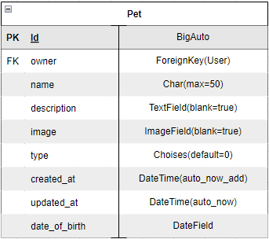

# Pet Palace API

The Pet Palace is a community site for pet lovers and pet owners where they can connect, add information about their pets, share images and posts, arrange petsittings and interact with each other.

The users can rate other users based on their petsittings and leave a review to make other pet owners feel safe when choosing someone to take care of their beloved pet.

Users can also send messages to each other, show interest in other users' ads and follow the profiles of people they like.

The project is a Django REST Framework project and the fifth and final project with Code Institute.

This is the API and backend part, the front end is a React project that can be found [here](https://github.com/Ajn0r/pet-palace)

The API is deployed to Heroku and can be found [here](https://pet-palace-api.herokuapp.com/)

The deployed React project is found [here](#)

- [Pet Palace API](#pet-palace-api)
  * [Models](#models)
  * [Apps](#apps)
    + [Profile app](#profile-app)
    + [Post app](#post-app)
    + [Comment app](#comment-app)
    + [Like app](#like-app)
    + [Follower app](#follower-app)
    + [Pet app](#pet-app)
    + [Ad app](#ad-app)
    + [Ad Interest App](#ad-interest-app)
    + [AppMessage App](#appmessage-app)
    + [Pet Sitting app](#pet-sitting-app)
    + [Rating app](#rating-app)
  * [Technologies and resources used](#technologies-and-resources-used)
    + [Languages](#languages)
    + [Modules](#modules)
    + [Platforms, libraries and programs](#platforms-libraries-and-programs)
    + [Resources](#resources)
  * [Setting up the project](#setting-up-the-project)
  * [Deployment](#deployment)
    + [Setting up JSON web tokens](#setting-up-json-web-tokens)
    + [Prepare the API for deployment to Heroku](#prepare-the-api-for-deployment-to-heroku)
    + [Deployment to Heroku](#deployment-to-heroku)
    + [dj-rest-auth logout bug fix](#dj-rest-auth-logout-bug-fix)
    + [Setting up API for use with a front-end project](#setting-up-api-for-use-with-a-front-end-project)
    + [Nov 2022 update](#nov-2022-update)
  * [Testing](#testing)
  * [Bugs](#bugs)
    + [Ad](#ad)
    + [AppMessage](#appmessage)
    + [PetSittings](#petsittings)
    + [Pets](#pets)
    + [Posts](#posts)
    + [Ratings](#ratings)
    + [Date validation](#date-validation)
    + [Pagination](#pagination)
  * [Credits](#credits)

## Models

At the start of the project, a database model was created to map out the scope and information needs for the database.
The post, comments, likes, following and profile entities are greatly inspired by the Code Institue django rest API walkthrough project, the rest is custom to this project.

A conceptual model was made at first to easily visualise what the database would look like and which entities were needed.


Once that was finished a more detailed logical database model was made with all attributes and data types.


## Apps

The Pet Palace API has got 11 apps, the different apps and their purpose are described here:

### Profile app


An app for the user's profile, the profile is created automatically when they sign up and create a user, the profile can only be edited, it is not possible to delete it, and the user can also only have one profile. There is also some functionality to count the number of followings and followers.

The profile model holds information about the user,
such as name, description of them, profile image, if they are a pet owner or not,
and when the profile was created and updated.

A default image will be displayed until the user changes it, this is from the Code Institute django rest walkthrough.

If the user is a pet owner, they will need to update their profile and check the checkbox for a pet owner, if not, they will be a regular user.
If the user checks the pet owner box, they will get a small icon next to their name, and users should be able to filter to display posts and ads from only pet owners if they'd like.

### Post app


The code for the Post app is greatly inspired by the Code Institute django rest framework walkthrough, with minor alterations to fit my project.

All logged-in users will be able to create, update and delete a post.
The post will contain an image, title, content, category, date of creation and date of updating.

The content field is allowed to be blank, but the user must add a title, if they don’t add an image a default will be displayed.
The user can also add a filter to the image.

There is some filter and search functionality as well as some functionality to count the number of comments and likes on each post, all from the Code Institute django rest walkthrough code.

### Comment app


The code for the comment app comes from the Code Institute django rest walkthrough with minor alterations and some added testing.
It allows users to comment on each other's posts and the user can view, update and delete comments.

The user must be logged in to be able to comment and can only edit and delete the comment that they made.

### Like app


The code for the like app comes from the Code Institute django rest walkthrough with minor alterations such as using UniqueConstraint instead of unique_toghether.

It allows users to like each other's posts as well as view and delete the likes, the user must be logged in to be able to like a post and can only delete the likes that they made, they can only like a post once.

### Follower app


The code for the follower app comes from the Code Institute django rest walkthrough with minor alterations such as using UniqueConstraint instead of unique_toghether.

It allows users to follow each other

### Pet app



The pet app will contain information about the pet, such as name, what type of pet it is, how old it is, an image of the pet and a description where the owner can describe their pet and write some information that could be good for the potential pet sitter. The pet will be linked to the owner with a Foreign Key.

I considered adding a field for the breed as well but decided not to in this release, the motive being that I then wanted the user to be able to choose from a list of different breeds for each of the different types of pets. These lists would be massive and outside of the scope of this project, if I were to let the owner add it them self I could end up with many duplicates, for example, pug, pugs, pugg, and so on for every misspelling.
It could be a feature for future releases since it would add value to the user to be able to filter for breeds as well, for this release, however, the owner can put what type of breed it is in the description and the user can then search for it.

I considered making the name unique for the owner, but since a pet owner could have named their pets the same name, I decided to restrict the user from having pets with the same name born on the same day.
While a pet owner could have two pets with the same name, it’s doubtful that they were born on the same day, it’s still not impossible, however, I choose to restrict it.
If the user has two pets with the same name born on the same day, they will need to separate them not to confuse the other users and potential pet-sitter with some sort of uniqueness, for example, Molly1 & Molly2.

There is a filter functionality for the different types of pets, and a search function for the owner's username, the pet's name or for a word or sentence in the description.

### Ad app


The Ad app is of use for both pet owners and pet sitters, they can both make ads depending on if they require a pet sitter, or is available for pet sittings. The ad contains a title, description, image, dates from and to, compensation, location, status, pets, type and dates of creation and updating.

The compensation is a Charfield to give the user a bit more freedom to choose what type of compensation that will be given or wanted, the image field allows the user to add an image of either their pets or themselves, the latter mainly for pet-sitters.

The status fields allow the user to choose if it’s a draft, active, ongoing or finished and the Type attribute allows users to specify if it is a pet-sitting, pet-sitter or other ad making it easy to filter later.
The pet attribute is a multiple-choice where the user can specify what type of pet they either need a pet sitting or can pet sit.

The users can filter ads on pets, status and the type of ad it is.

### Ad Interest App


The code for the ad interest app comes from the Code Institute django rest walkthrough with minor alterations such as using UniqueConstraint instead of unique_toghether.

It is very similar to the likes app and allows users to show interest in each other's ads.
The user must be logged in to be able to add interest to an ad and can only delete the interests that they made, they can only show interest in a specific ad once.

### AppMessage App


The AppMessage App lets Logged-in users send messages to each other that will contain a subject, the content of the message and the date and time when it was sent. The user can see all messages either sent by them or sent to them with the help of a custom filter, which also restricts other users from viewing any messages that are not sent to or from them.

Updating the message is not possible since that would cause some confusion, the owner of the message can, however, delete it. I realise that it might not be the best solution for messages since the message will be deleted for both parties if the owner deletes it, it is however the only solution I could think of for the scope of the project as well as where my knowledge level is at the moment.

Even though there might be lacking some functionality to make it smoother, the main goal of the messaging app was to let users contact each other for setting up pet sittings. A future feature could be to add chat functionality with Django Channels, but for the scope of this project, I feel that the most important goal is met, which is that the user can send messages and only view the messages that belong to them.

The receiver field is ordered so that users that the owner is following will be displayed first.

### Pet Sitting app


The pet-sitting app acts like a contract between the pet owner and pet sitter, that owner can connect their pets to the pet-sitting to be able to track which user pet sat which pet or pets. The pet-sitting model is very similar to the Ad except for the pets attribute, which is a many-to-many relationship with the Pet model. The field is allowed to be blank in case the user does not want to attach their pets to the pet sitting.

The user can only choose from their pets and is allowed to connect more than one pet to the pet sitting. When trying to limit the choices for pets in the ads app I had no luck, I did find a solution for this model and it is credited in both the code and readme under [Ads bug](#bugs) and [Credits](#credits). When choosing a petsitter the users are ordered by the profiles that the owner follows, the owner can not choose from users that have staff status or themselves.

The owner of the pet sitting is allowed to update and delete it, if the pet sitter wants to change something they will have to send a message to the owner and request it, and if the owner agrees they can change or delete it.

If the petsitter deletes their account, which can only be done by contacting admin, the petsitter foreign key value will be set to a "Deleted" user. Otherwise, all the pet sittings for the owner that are connected to that pet sitter will be deleted which would be unfortunate.
It was difficult deciding what would be the best solution, CASCADE or SET since the petsitting is the petsitter's form of the contract it's of value for them to save the information. However if the petsitting is not connected to a real user it loses a bit of its purpose, but to add some sort of control I decided to assign it to the 'fake' deleted user.
The admin could then send a message to the petsitting owner and inform them that the petsitter had deleted their account and let them decide if they want to keep them or not. If a pet owner has many petsitting by the same user they would otherwise lose all of that data which of course is not ideal, the downside of the solution is that the data stored takes up space in the database.

The user can filter, order and search on the pet-sitting list view, they can filter by owner, pets, petsitter and status, order by dates to, from and created at and the status. The search filter takes the pet's name and location, the user can also search for words or sentences in the description.

It would be nice to have a functionality where the pet-sitting is only created if both parties accept the pet-sitting, but that is beyond the scope of this project and my knowledge at the time, there might be some way of implementing this on the front-end side however that is for future endeavours with React.

### Rating app


The rating app allows the petsitting owner to rate the petsitting. The rating is connected with the petsitting using a foreign key and on the profile of the user that pet sat the average rating score will be displayed using Avg in the .annotate function on the query set.

The user can rate anywhere from 1 to 5 and leave a comment for the rating. The rating needs to be linked to a pet sitting to prevent users to rate other users without having done a pet sitting for them, the owner can also only rate a pet sitting once. The list of the petsittings to rate only displays sittings that have the status of finished and are ordered by date_to, making the newest finished petsitting on top.

I first had a field 'rated' that was a foreign key to the user that was to be rated but found out I could connect it to the petsitter via the petsitting attribute instead.

## Technologies and resources used

### Languages

- Python
  - The Django REST framework base language

### Modules


### Platforms, libraries and programs

- Heroku
  - Used to deploy the application
- Git
  - For version control, committing and pushing to GitHub
- GitHub
  - For storing the repository, files and images pushed from Gitpod
- Gitpod
  - IDE used to code project
- Django REST Framework
- Django
- Cloudinary
  - Storage for images
- Pillow
  - Image processing capabilities
- PostgreSQL
- Cors Headers
- Django Rest Auth
- Django Filters

### Resources

- [Drawio](https://app.diagrams.net/)
  - for creating the er diagrams
- [Code Institute's](https://codeinstitute.net/) Django REST walkthrough project and cheat sheet for guidance for both setup, development and deployment of this project
- [The Django REST documentation](https://www.django-rest-framework.org/)
  - for a better understanding of the Framework and finding solutions.
- [The Django documentation](https://docs.djangoproject.com/en/3.2/)
- [The Django filters documentation](https://django-filter.readthedocs.io/en/stable/)
- [Stack Overflow](https://stackoverflow.com/)
  - for ideas and inspiration on solutions.

Default images for profiles and posts are from the Code Institute Django REST project.

## Setting up the project

I have followed the Code Institutes template from the Django rest DRF_API walkthrough to set up the project with Django and Cloudinary.

01. The first step was to use the Code institute full template to create a new repository and open it in Gitpod.

02. Installing Django from the terminal `pip3 install 'django<4'`

03. Create a project: `django-admin startproject pet_palace_api`

04. Cloudinary libraries to manage static files `pip install django-cloudinary-storage`

05. Add Pillow for image processing `pip install Pillow`

06. Add cloudinary to INSTALLED_APPS

07. Create an env.py file and import os `import os`

08. Set the url variable value `os.environ['CLOUDINARY_URL'] = 'cloudinary://my-API-Environment-variable'`

09. Import os and add if statement in setting.py

    ```bash
    import os
    if os.path.exists('env.py'):
        import env

    ```

10. Setting the CLOUDINARY_STORAGE variable to equal the CLOUDINARY_URL variable

    ```bash
    CLOUDINARY_STORAGE = {
        'CLOUDINARY_URL': os.environ.get('CLOUDINARY_URL')
    }
    ```

11. Add media storage URL `MEDIA_URL = '/media/'`

12. Set default file storage to cloudinary

    ```bash
    DEFAULT_FILE_STORAGE = 
        'cloudinary_storage.storage.MediaCloudinaryStorage'
    ```

Now the basic project was finished, the next step were to start setting up all the apps and adding them to the settings.py file.

## Deployment

I used the Code Institute Django REST framework project cheat sheet for the deployment of the project.

### Setting up JSON web tokens

1. Installed the django rest auth package by using the terminal command `pip3 install dj-rest-auth`

2. In settings.py added both the authtokens and rest auth to the INSTALLED_APPs list:

    ```bash
    INSTALLED_APPS = [
        'django.contrib.admin',
        'django.contrib.auth',
        'django.contrib.contenttypes',
        'django.contrib.sessions',
        'django.contrib.messages',
        'cloudinary_storage',
        'django.contrib.staticfiles',
        'cloudinary',
        'rest_framework',
        'django_filters',
        'rest_framework.authtoken',
        'dj_rest_auth',
    ```

3. In the main urls.py file added the rest auth URL to the patterns list:

    `path('dj-rest-auth/', include('dj_rest_auth.urls'))`

4. Migrated the database using the terminal command `python3 manage.py migrate`

5. To allow users to register installed Django Allauth with the command

    `pip3 install 'dj-rest-auth[with_social]’`

6. In settings.py added the following to the installed app list

    ```bash
    'django.contrib.sites', 
    'allauth', 
    'allauth.account', 
    'allauth.socialaccount', 
    'dj_rest_auth.registration', 
    ```

7. Added the SITE_ID in settings.py
    `SITE_ID = 1`

8. In the main urls.py file added the registration URL to patterns

    ```bash
    path(
        'dj-rest-auth/registration/',
        include('dj_rest_auth.registration.urls')),
    ```

9. Installed the JSON tokens with the command

    `pip3 install djangorestframework-simplejwt`

10. In env.py set DEV to 1 to check if in development or production

    `os.environ['DEV'] = '1'`

11. In settings.py added an if/else statement to check if the project is in development or production

    ```bash
    REST_FRAMEWORK = { 
        'DEFAULT_AUTHENTICATION_CLASSES': [( 
            'rest_framework.authentication.SessionAuthentication' 
            if 'DEV' in os.environ 
            else 'dj_rest_auth.jwt_auth.JWTCookieAuthentication' 
            )],
    ```

12. To enable token authentication added REST_USE_JWT and set it to True, for making sure that tokens are only sent over HTTPS JWT_AUTH_SECURE was set to True. To declare cookie names for access and refresh tokens JWT_AUTH_COOKIE and JWT_AUTH_REFRESH_COOKIE values were set.
These were added to the settings.py file:

    ```bash
    REST_USE_JWT = True
    JWT_AUTH_SECURE = True
    JWT_AUTH_COOKIE = 'my-app-auth'
    JWT_AUTH_REFRESH_COOKIE = 'my-refresh-token'
    ```

13. Created serializers.py file in the pet_palace_api directory, and copied the UserDetailsSerializer code from the Code Institue Django REST framework walkthrough that came from the Django REST documentation:

    ```bash
    from dj_rest_auth.serializers import UserDetailsSerializer
    from rest_framework import serializers


    class CurrentUserSerializer(UserDetailsSerializer):
        """
        For getting user profile information
        Code from Code Institute Django REST
        Framework project.
        """
        profile_id = serializers.ReadOnlyField(source='profile.id')
        profile_image = serializers.ReadOnlyField(source='profile.image.url')

        class Meta(UserDetailsSerializer.Meta):
            fields = UserDetailsSerializer.Meta.fields + (
                'profile_id', 'profile_image'
            )

    ```

14. In settings.py overwrite the default User Detail serializer

    ```bash
    REST_AUTH_SERIALIZERS = { 
        'USER_DETAILS_SERIALIZER': 'pet_palace_api.serializers.CurrentUserSerializer'
    }
    ```

15. Run the migrations for the database again with the command:

    `python3 manage.py migrate`

16. Updated the requirements file with the command:

    `pip3 freeze > requirements.txt`

17. Made sure to save all files, add and commit all changes and pushed to GitHub.

    ```bash
    git add .
    git commit -m "message"
    git push
    ```

## Prepare the API for deployment to Heroku

18. To add a custom welcome message to the root_route, I created a views.py file in the pet_palace_api directory and added the following code:

    ```bash
    from rest_framework.decorators import api_view
    from rest_framework.response import Response


    @api_view()
    def root_route(request):
        return Response({
            'message': 'Welcome to the Pet Palace API!'
        })
    ```

19. Imported root_route to the main urls.py file, and added the path to the top of the urlpatterns list

    ```bash
    from .views import root_route

    urlpatterns = [
        path('', root_route),

    ```

20. To set up pagination for all pages, added this code to settings.py REST_FRAMEWORK setting

    ```bash
    REST_FRAMEWORK = {
        'DEFAULT_AUTHENTICATION_CLASSES': [(
            'rest_framework.authentication.SessionAuthentication'
            if 'DEV' in os.environ
            else 'dj_rest_auth.jwt_auth.JWTCookieAuthentication'
        )],
        'DEFAULT_PAGINATION_CLASS':
        'rest_framework.pagination.PageNumberPagination',
        'PAGE_SIZE': 10,
    }
    ```

21. Set the default renderer to JSON if not in development, in settings.py added:

    ```bash
    if 'DEV' not in os.environ:
        REST_FRAMEWORK['DEFAULT_RENDERER_CLASSES'] = [
            'rest_framework.renderers.JSONRenderer',
        ]
    ```

22. To set up DATETIME_FORMAT and DATE_FORMAT this code was added to REST_FRAMEWORK in settings.py under pagination code

    ```bash
        'DATETIME_FORMAT': '%d %b %Y',
        'DATE_FORMAT': '%d %b %Y',
    ```

23. Add naturaltime format to show how long ago since a comment was created and updated for comments. Added the following code to CommentSerializer in the serializers.py file:

    ```bash
    from django.contrib.humanize.templatetags.humanize import naturaltime

        created_at = serializers.SerializerMethodField()
        updated_at = serializers.SerializerMethodField()

        def get_created_at(self, obj):
            return naturaltime(obj.created_at)

        def get_updated_at(self, obj):
            return naturaltime(obj.updated_at)

    ```

24. Added, committed and pushed changes to GitHub

## Deployment to Heroku

25. Logged into my Heroku account and created a new app.

26. In the 'Resources' tab searched for Heroku Postgres in the Add-Ons section, and select the free plan.

27. In the 'Settings' tab clicked on 'Reveal Config Vars' to confirm that DATABASE_URL was there.

28. Returned to my Gitpod workspace, to install the correct package version needed to use the Heroku Postgres database this command was used:

    `pip3 install dj_database_url==0.5.0 psycopg2`

29. Imported dj_database_url to settings.py:

    ```bash
    import dj_database_url
    ```

30. In settings.py updated the DATABASES variable to separate development and production environments:

    ```bash
    DATABASES = {
        'default': ({
            'ENGINE': 'django.db.backends.sqlite3',
            'NAME': BASE_DIR / 'db.sqlite3',
        } if 'DEV' in os.environ else dj_database_url.parse(
            os.environ.get('DATABASE_URL')
        ))
    }
    ```

31. Installed Gunicorn library with the command

    `pip3 install gunicorn`

32. Added a Procfile to the top level of the directory and added the following code

    ```bash
    release: python manage.py makemigrations && python manage.py migrate

    web: gunicorn pet_palace_api.wsgi
    ```

33. Set ALLOWED_HOSTS in settings.py:

    ```bash
    ALLOWED_HOSTS = [
        os.environ.get('ALLOWED_HOST'),
        'localhost',
    ]
    ```

34. Installed Cors Headers library with the terminal command

    `pip3 install django-cors-headers`

35. Added 'corsheaders' to INSTALLED_APPS in settings.py

    ```bash
    INSTALLED_APPS = [
        ...
        ...
        'corsheaders',
    ```

36. To the top of the MIDDLEWARE variable in settings.py, added the corsheaders middleware

    ```bash
    MIDDLEWARE = [
        'corsheaders.middleware.CorsMiddleware',
        ...
        ...
    ]
    ```

37. Set ALLOWED_ORIGINS for network requests to the server and allow cookies with CORS_ALLOW_CREDENTIALS in settings.py:

    ```bash
    if 'CLIENT_ORIGIN' in os.environ:
        CORS_ALLOWED_ORIGINS = [
            os.environ.get('CLIENT_ORIGIN'),
            os.environ.get('CLIENT_ORIGIN_DEV')
        ]

    else:
        CORS_ALLOWED_ORIGIN_REGEXES = [
            r"^https://.*\.gitpod\.io$",
        ]
    CORS_ALLOW_CREDENTIALS = True
    ```

38. Set JWT_AUTH_SAMESITE to 'None' to allow the front-end app and API to be deployed to different platforms, in settings.py added to the bottom of already set variables:

    ```bash
    # REST_USE_JWT = True
    # JWT_AUTH_SECURE = True
    # JWT_AUTH_COOKIE = 'my-app-auth'
    # JWT_AUTH_REFRESH_COOKIE = 'my-refresh-token'
    JWT_AUTH_SAMESITE = 'None'
    ```

39. In env.py, set the SECRET_KEY value to a random value: 

    ```bash
    os.environ['SECRET_KEY'] = 'my random value here'
    ```

40. In settings.py, replaced the default SECRET_KEY variable with:

    ```bash
    SECRET_KEY = os.environ.get('SECRET_KEY')
    ```

41. In settings.py, set DEBUG from True to:

    ```bash
    DEBUG = 'DEV' in os.environ
    ```

42. Copied the CLOUDINARY_URL and SECRET_KEY values from env.py and added them to the Heroku config vars.

43. Added config var COLLECT_STATIC and set it to 1.

44. Updated the requirements.txt file with new dependencies

	`pip3 freeze > requirements.txt`

45. Added, committed and pushed changes to GitHub.

46. On Heroku clicked on the 'Deploy' tab, and on 'Deployment Method' chose GitHub.

47. Connected it to my pet-palace-api repository.

48. In the 'Manual Deploy' section I selected the Main branch and clicked 'Deploy Branch'.

49. Monitored the build log to ensure no error messages were displayed. If the build was successful, the app is now deployed.

50. Click on 'Open app' to access the deployed app.

### dj-rest-auth logout bug fix

dj-test-auth currently has a bug that does not allow users to log out, to solve the situation these steps were followed:

51. In the drf_api views.py file, import JWT_AUTH settings from settings.py:

    ```bash
    from .settings import (
        JWT_AUTH_COOKIE, JWT_AUTH_REFRESH_COOKIE, JWT_AUTH_SAMESITE,
        JWT_AUTH_SECURE)
    ```

    and added the following logout view code:

    ```bash
    @api_view(['POST'])
        def logout_route(request):
        """
        dj-rest-auth logout view fix from Code Institute
        Django REST Framework project
        """
        response = Response()
        response.set_cookie(
        key=JWT_AUTH_COOKIE,
        value='',
        httponly=True,
        expires='Thu, 01 Jan 1970 00:00:00 GMT',
        max_age=0,
        samesite=JWT_AUTH_SAMESITE,
        secure=JWT_AUTH_SECURE,
        )
        response.set_cookie(
        key=JWT_AUTH_REFRESH_COOKIE,
        value='',
        httponly=True,
        expires='Thu, 01 Jan 1970 00:00:00 GMT',
        max_age=0,
        samesite=JWT_AUTH_SAMESITE,
        secure=JWT_AUTH_SECURE,
        )
        return response
    ```

52. Import the logout_route in the main urls.py file and added to the urlpatterns list. The logout_route must be placed above the default dj-rest-urls.

    ```bash
    from .views import root_route, logout_route
    ```

    ```bash
        path('dj-rest-auth/logout/', logout_route),
        path('dj-rest-auth/', include('dj_rest_auth.urls')),
    ```

53. Added, committed and pushed changes to GitHub

54. Deployed manually from Heroku again

### Setting up API for use with a front-end project

To make the API work with the front end part some environment variables needed to be updated

55. Copy the `... .herokuapp.com` value from ALLOWED_HOSTS in settings.py

    ```bash
    ALLOWED_HOSTS = [
        '... .herokuapp.com',
        'localhost',
    ]
    ```

56. In Heroku, under settings add a new config vars with the key ALLOWED_HOST and the value of the copied value from the ALLOWED_HOST in the settings.py file.

57. In settings.py, replace the copied value with the new ALLOWED_HOST environment variable

    ```bash
    ALLOWED_HOSTS = [
        os.environ.get('ALLOWED_HOST'),
        'localhost',
    ]
    ```

58. Gitpod regularly changes its URL for the workspaces to make it more secure, to keep the API working with the front-end project later import the regular expression in settings.py

    ```bash
    import re
    ```

59. Replace the if/else statement for CLIENT_ORIGIN with the following:

    ```bash
    if 'CLIENT_ORIGIN_DEV' in os.environ:
        extracted_url = re.match(r'^.+-', os.environ.get('CLIENT_ORIGIN_DEV', ''), re.IGNORECASE).group(0)
        CORS_ALLOWED_ORIGIN_REGEXES = [
            rf"{extracted_url}(eu|us)\d+\w\.gitpod\.io$",
        ]
    ```

The value for CLIENT_ORIGIN_DEV will be set in Heroku once the front-end projects are up and running

60. Add, commit and push changes to GitHub

61. Manually deploy the API in Heroku once again

### Nov 2022 update

The database was migrated to ElephantSQL and the Heroku Postgres add-on was disconnected from the app in Heroku.
The DATABASE_URL was then updated in the config vars on Heroku and the env.py file in the workspace.

## Testing

All testing documentation can be found [here](TESTS.md)

## Bugs

While not being a but it is still worth mentioning, I did discover that interest is misspelt in a couple of places in the code.
It's 'intrest' instead of interest, since it was discovered late in the development I let it be as is since I did not want to mess up, and it is still understandable even if it does have a Swedish flair to it.

### Ad

The initial plan in the Ad model was to have Pets as a many-to-many relation pointing to pets to allow pet owners to connect their pets with the ad. This turned out to be somewhat of a headache as I only wanted the user to be able to choose from their pets and getting that HTML form input didn't support lists when I thought I solved it.
Later when creating the pet-sitting app I found a solution to handle it, but decided to leave the ads model as it was due to the following reasons:

The main purpose what to let users filter ads on what type of pets it was, but that was solved by adding a pet attribute with choices instead.
The pets belonging to the pet owner can still be found on their profile therefore I think it was an alright solution, as well as not getting any nulls if the ad is made by a pet sitter who doesn't have any pets, now the pet sitter can also specify what type of pets they are open to pet sit, making it easy to filter out all pet sitters who can pet sit dogs for an example.

This solution also doesn't create any more tables in the database as the initial plan would, which is better for the performance of the database.

The solution for how to handle the many-to-many situation was found [here](https://medium.com/django-rest-framework/limit-related-data-choices-with-django-rest-framework-c54e96f5815e)

### AppMessage

There were some issues when a user would try to log out when being on /messages/ after I filtered out the results for the owner and receiver, I got a TypeError that was solved by adding .id to the querysets in the filter.


### PetSittings

I had set on_delete to SET('delete') on the petsitter foreign key since I wanted the petsitting to still exist even if the petsitter was deleted, however, this was not configured correctly and therefore it didn't allow the deletion of a user.
I found a solution where a user with the username 'deleted' was created and all the pet sittings whose petsitter was deleted would be set to that user instead.

Solution was inspired by [this code](https://django.fun/en/qa/426873/)

### Pets

On the pets list, the pet owner wasn't displaying due to the source being not correct, it was resolved by adding the source 'owner.username' to the serializer.

There was a logical error in the age calculation for the pet, I had set that it should return the number of days the pet is if it was under one month, however, I did not take into consideration that it would return the days if the pet was for example 3 years and 0 months. This was solved by adding 'and years <= 0' to the ternary.

### Posts

Comment count and likes count were correctly set up in the view but I had forgotten to set them in the serializer, therefore it didn't display those values. Once added in the serializer the values could be viewed on the posts.

### Ratings

I first had a rated attribute which was a foreign key to the User model to connect the user that was rated with the rating, this was however not necessary since it could be reached through the petsitting attribute instead. When trying to remove this with ratings already in the test database it caused some issues, I couldn't reach the admin page to remove them and I couldn't migrate either, the solution was to delete the migrations and start over, remove the ratings and then do it all again. It was a small bug that was quickly resolved.

I forgot to update the `__str__` function after I removed the foreign key to the rated user, so when trying to access ratings in the admin panel it threw an error, but that was a quick fix.

### Date validation

I wanted to only allow the user to choose from dates in the future for ads, however, for petsittings, I thought it would be good to let users register petsittings that might have started already or that had already finished. This was done by adding a validator to the date_from in the ads serializer. I then wanted to make sure that the date_to was after the start date, which first was solved by adding the code from the [Django REST framework documentation](https://www.django-rest-framework.org/api-guide/serializers/#object-level-validation), however, this caused the Unit tests to throw an error, even if the validation seemed to work during the manual testing.


I re-wrote the code a bit inspired by other solutions I had seen and ended up with a code that worked both for the manual and the Unit tests.


### Pagination

I wanted some of the models to be ordered by first one attribute, and then by another if there were multiple objects with the same value.

For example, petsittings are ordered first by status, but many petsittings can have the same status, I then want to order by date_from, but the same can be said here, many petsittings can have the same status and start date. Then the petsittings should be ordered by the newest first but this gave me a warning after adding pagination to settings.py, I tried adding .order_by to the queryset in the view, and the warnings disappeared so I guess that solved the issue.


## Credits

- Code Institute's Django REST Framework walkthrough project which I have followed for setting up this project, deployment and also for the first apps: profiles, posts, comments, likes and followers. The walkthrough has inspired the base of the rest of the apps and their functionality as well.

- Xavier Ordoquy's [solution on medium.com](https://medium.com/django-rest-framework/limit-related-data-choices-with-django-rest-framework-c54e96f5815e) on how to limit the related data choises with Django REST framework.

- Code to calculate the age of the pets is inspired by Danny W. Adair's [solution on stackoverflow](https://stackoverflow.com/questions/2217488/age-from-birthdate-in-python)
