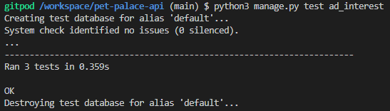
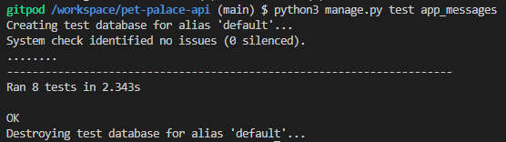
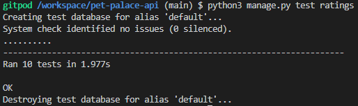
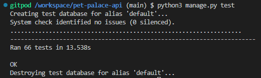

# Testing

## Unit testing

### Profile views

In the profile app, there was one automated test to make sure that a profile was created for every new user.

The test failed the first time due to that there were three users created and the test only expected two profiles,
when changed to expect three profiles instead the test was successful.

### Post views

Most of the tests in the Post app are from the Code Institute django rest walkthrough, however, four custom tests were made, two for deleting posts and two for making sure the correct default value was set.

All tests passed and can be found [here](../pet-palace-api/posts/tests.py)

### Comment views

The tests in the Comment app are inspired by the tests in the Code Institute django rest walkthrough.

All the tests passed without any problems, they can be found
[here](../pet-palace-api/comments/tests.py)

### Pet views

The pet views were tested with various tests, such as if the user could create, update and delete pets, the unique constraint was tested, that the user had the correct amount of pets associated with them and more.

One particularly tricky test was the update pet test, it was supposed to give a 200 response but instead, I got a 400 Bad Request, this was due to using the Put method instead of the Patch method. Once I figured out that the test passed without any issues.

All tests can be found [here](/pets/tests.py)

### Ad views

The ad views were tested with various tests, such as if the user could create, update and delete ads and only their own ads.
The create test failed first due to not adding all required fields, once all were added the test passed.

All tests can be found [here](/ads/tests.py)

### AdInterest views

The test for letting a user create and delete an interest first failed when having different owners, but passed if both the Ad and AdInterest owner were the same.
There was no issue when testing manually so I decided to let it go, it might have something to do with the name 'owner' being the same for the different models but I am not sure.

The tests did pass when owners were the same and the manual tests passed without any issues.

### AppMessage views

The AppMessage views were tested with various tests, such as if the user could send messages to other users, that the correct users were connected to the message, view the details of the message and if only the sender of the message could delete it.

The create test failed first due to not adding the user's ID which was required and not only the username, once the id was added the test passed.

All tests can be found [here](/app_messages/tests.py)

### PetSitting testing

The PetSitting views were tested to make sure that users can view, create, update and delete pet sittings. The PetSittingTest's purpose was to test that users can view pet sittings, they can create pet sittings and owners can only choose from their pets to connect with the pet sitting.
The PetSittingDetailTests were made to make sure that the detailed petsitting could be retrieved with the correct id and that users can edit and delete only the petsitting where they are the owner.

I had some issues with assigning a pet to the petsitting at first but learned that it needs to be assigned with a .set() method instead, which solved the issue and the tests were successful.

All tests can be found [here](/pet_sittings/tests.py)

### Rating view tests

The rating views were tested with various tests to make sure users can view, create, update and delete ratings.
The List/Create view was tested to make sure that users can only create ratings if they are logged in and are the owner of the petsitting to be rated and that they only can create one rating per petsitting.

The rating detail view that lets users update and delete ratings were tested to confirm that ratings can be retrieved with the correct id, and only can be updated and deleted by the rating owner.
All tests passed without issues.

All tests can be found [here](/ratings/tests.py)

### All tests

When all tests were done I did a test on them all at the same time, and the first two tests from the rating tests failed, due to that I had set that a user can only rate petsitting with the status of finished, and the testcase petsitting had the status of 'planned'. Once I added status=2 to the tests they all passed.

## Manual testing

Manual tests were made for all apps throughout the whole development process and after the first deployment, the last tests were carried out before moving on to the front-end project.

### URLs

URLs were tested throughout the development process and once deployed both the development and deployed version URLs were tested to make sure they worked in both. All URLs worked as intended.

## Validation

Validation was carried out for all files in all apps with the PEP8 validator pycodestyle in the Gitpod workspace. There were only some minor issues with whitespace and new lines missing at the end of the code which was easily fixed. In the settings.py file, five lines were too long, however, these were ignored by adding `# noqa` to the end of the lines since they were easily understood anyway and I felt like breaking it up might make it harder to understand, it was the 'auth passwords validators' and 'rest auth serializer' setting lines.

